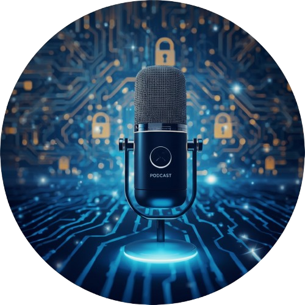

  

# Projeto Podcast Gerado por I.A.s
ℹ️ NOTE: Este é o repositório desenvolvido para o bootcamp da DIO

Projeto com o objetivo de gerar um podcast utilizando ferramentas de IA através de prompts mais trabalhado.

Utilizei uma esteira de prompts para gerar cada etapa do processo criativo.

## 💻 Tecnologias utilizadas no projeto
- [ChatGPT](https://chatgpt.com/)
- [Leonardo AI](https://leonardo.ai/)
- [NotebookLM](https://notebooklm.google/)
- [Pictory](https://pictory.ai/)
- [HeyGen](https://app.heygen.com/home)
- [CapCut](https://www.capcut.com/pt-br/)

## ✨ Como foi feito ?
- Roteiro gerado via chatgpt
- Audio gerado pelo NotebookLM e HeyGen
- Avatares gerados pelo HeyGen
- Pictory para gerar vídeo
- Leonardo AI Para gerar a capa
- Capcut para tratar aúdio e adicionar sons de fundo
